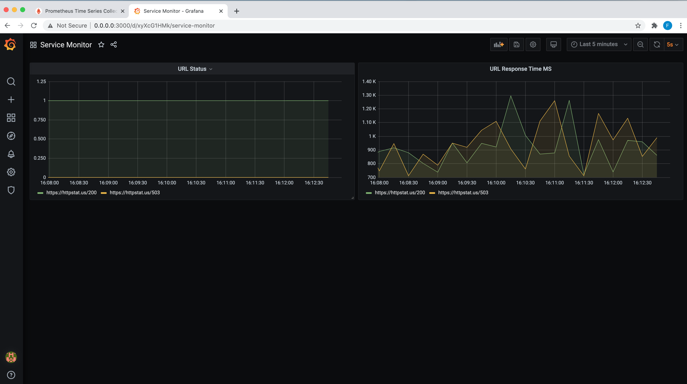
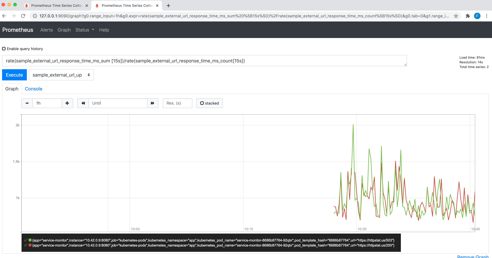
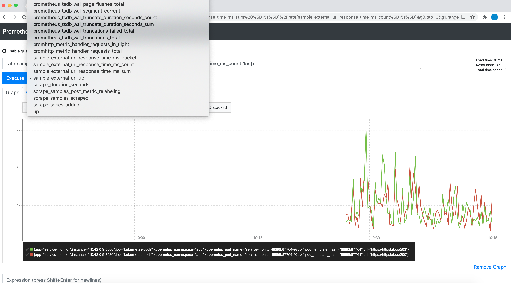

# Monitor 
Monitor is a url scraper to monitor internet urls and provide prometheus metrics. The design is similar to how prometheus scrapes for targets.

### Build

  1. Go to `monitor` root directory 
  2. Export two variable `NAMESPACE` and `TAG`
     ```
     export NAMESPACE=<you docker registry username>
     export TAG=<TAG for the Image>
     ```
  3. Run below command to build and push 
     ```
     make build && make push
     ```
  Note. Please make sure you are logged in your registry and credentails are saved in docker deamon.
  
### Kubernetes Deployment

Please make sure you have following installed, before you proceed to next steps.
1. `k3d`
2. `kubectl`

##### Create a local kubernetes cluster 
```
k3d cluster create
```
##### Clone this repository and change to service_monitor directory 
```
git clone https://www.github.com/arriqaaq/monitor.git && cd monitor
```

##### Create the kubernetes namespace required for the application 
```
kubectl apply -f namespace.yml
```

##### Apply the artifacts required to run the application 
```
kubectl apply -f ./yaml
```

### Prometheus
To access prometheus server, please run the following command:

```
kubectl port-forward -n app svc/prometheus 9090:9090 &
```

To view prometheus metrics, please open URL `http://localhost:9090` in your browser

### Grafana
To access grafana server, please run the following command:

```
kubectl port-forward -n app svc/grafana 3000:3000 &
```

### Create the grafana dashboard
  1. Go to your browser and access granfana using `http://localhost:3000`
  2. Enter below username and password
         ```
         User     : admin
         Password : admin
         ```
  3. Go to Create -> Import 
  
  4. Go to Import and upload the [dashboard.json](https://github.com/arriqaaq/monitor/blob/master/dashboard.json) file
  
  


### Metrics Screenshots

  
  
  
